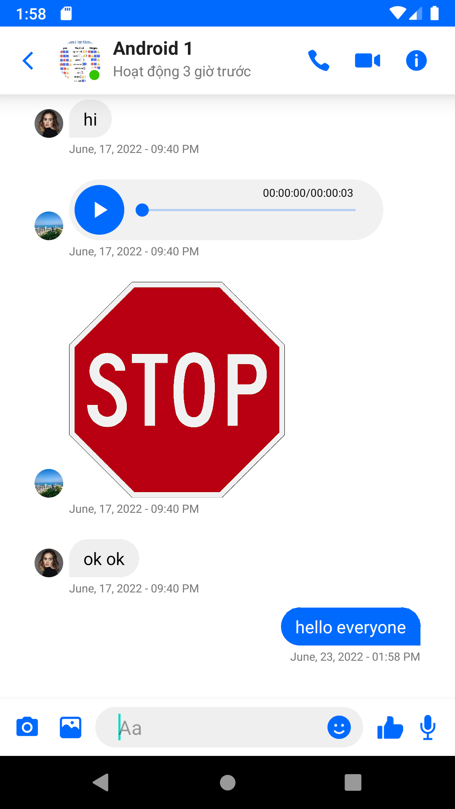

# ZaloClone
Basic Chat Application for Android
Final Project to pass the subject in school

## What works:
* One-on-one conversations and group chats.
* History Chat
* Attachments and inline images, voice messages.
* Upload and watch story like Facebook (just image)
* Video Call
* Message notifications (when user offline)

## Dependencies

* [Google-Services](https://firebase.google.com/docs/cloud-messaging/android/client) for push notifications. See below.
* [Picasso](https://square.github.io/picasso/) for image downloading and caching.
* [Jitsi](https://github.com/jitsi/jitsi-meet-sdk-samples/) for video calling
* [StoryView](https://github.com/OMARIHAMZA/StoryView) for displaying stories

## Push notifications
If you want to use the app with your own server and want push notification to work you have to set them up:

* Register at https://firebase.google.com/, set up the project if you have not done so already.
* [Download your own](https://developers.google.com/android/guides/google-services-plugin) config file `google-services.json` and place it to the `app/` folder of your copy of Tindroid project. The config file contains keys specific to your Firebase/FCM registration.
* Copy Google-provided server key to `Constants.java`, see details [here](https://stackoverflow.com/questions/37427709/firebase-messaging-where-to-get-server-key).
* Recompile the app. If you add `google-services.json` incorrectly the app will compile but will later crash with non-obvious exceptions.

## Screenshot
    

